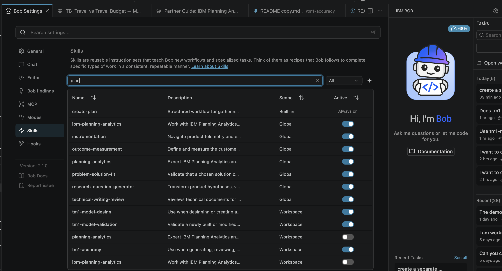
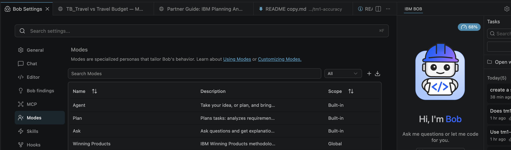
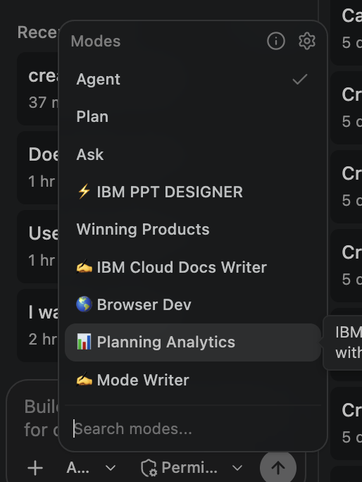
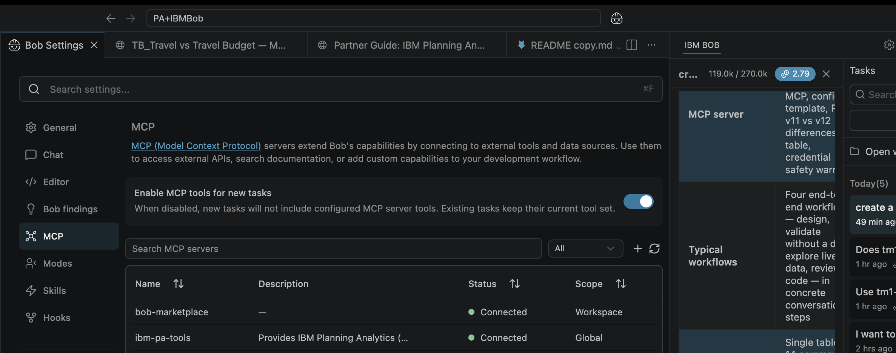

# Getting Started — IBM Bob for Planning Analytics

## Table of Contents

1. [What you are getting](#1-what-you-are-getting)
2. [How Bob's extension layers work](#2-how-bobs-extension-layers-work)
3. [Prerequisites](#3-prerequisites)
4. [Installation](#4-installation)
5. [Verify your setup](#5-verify-your-setup)
6. [The Planning Analytics mode ](#6-the-planning-analytics-mode)
7. [Skills](#7-skills)
   - [`tm1-accuracy` — Content verification](#tm1-accuracy--content-verification)
   - [`tm1-model-design` — Architecture and design](#tm1-model-design--architecture-and-design)
   - [`tm1-model-validation` — Post-build verification](#tm1-model-validation--post-build-verification)
   - [`ibm-planning-analytics` — REST API reference](#ibm-planning-analytics--rest-api-reference)
   - [`planning-analytics` — Natural language data exploration](#planning-analytics--natural-language-data-exploration)
   - [Using multiple skills together](#using-multiple-skills-together)
8. [The MCP server ](#8-the-mcp-server)
9. [Typical workflows](#9-typical-workflows)
10. [Quick-reference prompt guide](#10-quick-reference-prompt-guide)
11. [Troubleshooting](#11-troubleshooting)

---

## 1. What you are getting

This repo contains three custom Bob skills and a custom mode, purpose-built for Planning Analytics practitioners who want to use IBM Bob as an AI-powered assistant across the full TM1 model lifecycle:

| Asset | Type | What it does |
|---|---|---|
| `📊 Planning Analytics` | **Mode** | Activates the full PA toolset — MCP tools, PA-specific skills, and REST API guidance in one context |
| `tm1-accuracy` | **Skill** | Generates and reviews TM1 technical content (rules, TI, MDX, security) against IBM documentation |
| `tm1-model-design` | **Skill** | Designs TM1 models from scratch — cubes, dimensions, rules architecture, TI processes, PAW books |
| `tm1-model-validation` | **Skill** | Validates a built TM1 model for correctness — conformance against a design doc, or intrinsic structural checks |
| `ibm-planning-analytics` | **Skill** | REST API reference for TM1 + PAW — auth, OData patterns, TM1py, MDX cellsets |
| `planning-analytics` | **Skill** | Data exploration skill — natural language queries against live PA cubes via MCP |

Used together, these assets let Bob assist with the full delivery cycle: **design → build → validate → explore**.

---

## 2. How Bob's extension layers work

Before installing anything, it helps to understand how the three extension layers relate to each other. 

```
┌─────────────────────────────────────────────────────────┐
│                    IBM Bob (the AI agent)               │
├─────────────┬───────────────────────┬───────────────────┤
│   MODES     │        SKILLS         │    MCP SERVER     │
│             │                       │                   │
│ Set the     │ Load specialised      │ Connect Bob to    │
│ persona,    │ knowledge and         │ live systems —    │
│ toolset,    │ methodology into      │ your TM1 server,  │
│ and rules   │ the conversation      │ PAW, or REST APIs │
│ for a task  │ context on demand     │                   │
│             │                       │                   │
│ Analogy:    │ Analogy:              │ Analogy:          │
│ A TM1       │ A reference file      │ A TI data source  │
│ security    │ loaded into a TI      │ connection —      │
│ role        │ process at runtime    │live, bidirectional│
└─────────────┴───────────────────────┴───────────────────┘
```

**Modes** define what Bob is allowed to do and which tools are available. The `📊 Planning Analytics` mode loads the right toolset and persona automatically — always start there for PA work.

**Skills** are loaded into the conversation when triggered by a phrase or explicitly invoked. They carry verified TM1 knowledge, methodology, checklists, and reference files that Bob uses to produce accurate output. They are loaded on demand — Bob only loads what is relevant.

**MCP server** is what makes Bob "live". Without it, Bob can design and review but cannot query or act on your actual TM1 server. With it, Bob can list cubes, run MDX, execute TI processes, explore data, and run the automated validation sweep against a real database.

---

## 3. Prerequisites

### IBM Bob
- IBM Bob installed and running (any version with skills and custom modes support)
- A Bob workspace folder — this is the project root where `.bob/` lives


### For live TM1 tasks (MCP server)
- Access to a Planning Analytics instance — **PA v11 on-prem / TM1 Server**, or **PA v12 / PAaaS (SaaS)**
- For PAaaS: your MCSP API key and tenant ID (from the browser URL `?tenantId=…`)
- For on-prem: TM1 server hostname, port, and credentials (basic auth or CAM)
- The IBM PA MCP server configured — see [Section 8](#8-the-mcp-server--live-tm1-server-access)


---

## 4. Installation 

### Step 1 — Clone the repo into your Bob workspace

Place the skills and mode files where Bob can find them. The `.bob/` directory should be at the **root of your workspace** (the folder Bob is opened against).

```bash
# Option A — clone directly as your workspace root
git clone https://github.com/your-org/pa-bob-skills.git my-pa-workspace
cd my-pa-workspace

# Option B — clone into an existing workspace
cd /path/to/your/workspace
git clone https://github.com/your-org/pa-bob-skills.git .bob-pa-skills
# Then copy the .bob/ contents into your existing .bob/ folder
```

### Step 2 — Confirm the folder structure

After cloning, your workspace should contain:

```
your-workspace/
├── .bob/
│   ├── mcp.json                          ← MCP server config (edit this)
│   └── skills/
│       ├── tm1-accuracy/
│       │   ├── SKILL.md
│       │   └── references/               ← Required — do not delete
│       ├── tm1-model-design/
│       │   ├── SKILL.md
│       │   └── references/               ← Required — do not delete
│       ├── tm1-model-validation/
│       │   ├── SKILL.md
│       │   ├── references/               ← Required — do not delete
│       │   └── scripts/                  ← Validation script and spec template
│       ├── ibm-planning-analytics/
│       │   ├── SKILL.md
│       │   └── references/
│       └── planning-analytics/
│           ├── SKILL.md
│           └── USAGE-GUIDE.md
└── GETTING-STARTED.md                    ← This file
```

> **The `references/` folders are not optional.** Each skill's SKILL.md loads content from its `references/` subdirectory at runtime. If those files are missing, the skill activates but has nothing to cross-check against.

### Step 3 — Install the Planning Analytics mode


The `📊 Planning Analytics` mode is defined in Bob's custom modes configuration. To install it:

1. Open Bob's settings → Custom Modes (or edit `.bob/custom_modes.yaml` directly if your Bob version supports file-based mode config)
2. Add the mode definition provided in `modes/planning-analytics-mode.yaml` from this repo
3. Restart Bob or reload the workspace

Once installed, `📊 Planning Analytics` will appear in Bob's mode selector.


### Step 4 — Configure the MCP server (live TM1 access only)

See [Section 8](#8-the-mcp-server--live-tm1-server-access) for full setup. At minimum, edit `.bob/mcp.json` to point at your PA MCP server endpoint and supply your credentials.

---

## 5. Verify your setup

Run through this checklist before your first real task:

- [ ] **Skills  in Bob Settings** - Go to Bob Settings in top right corner. Once you open Settings, select Skills tab. You should be able to see all the skills you just installed.



- [ ] **Modes  in Bob Settings** - Go to Bob Settings in top right corner. Once you open Settings, select Modes tab. You should be able to see all the modes you just installed.



- [ ] **Mode loads** — switch to `📊 Planning Analytics` in Bob's mode selector; it should switch without error



- [ ] **Skills activate** — in a new conversation in PA mode, type: `"Check this TI code for accuracy"` — Bob should acknowledge the `tm1-accuracy` skill

- [ ] **Reference files present** — ask Bob: `"List the reference files available in the tm1-accuracy skill"` — it should name the six files under `references/`

- [ ] **MCP  in Bob Settings** - Go to Bob Settings in top right corner. Once you open Settings, select MCP tab. You should be able to see all the MCP Server you just installed.Once it shows status as connected with a green circle,it is ready to use.



- [ ] **MCP connection (if configured)** — ask Bob: `"List the available TM1 servers"` — it should return your server names, not an error


---

## 6. The Planning Analytics mode 

Always start PA work in the `📊 Planning Analytics` mode. It does three things that the default Agent mode does not:

**1. Activates PA-specific MCP tools**  
The full set of IBM PA MCP tools is available — `get_tm1_cubes`, `get_cube_dimensions`, `execute_mdx_and_get_view`, `get_data_from_data_explorer`, `perform_impact_analysis`, `perform_outlier_detection`, `create_tm1_process`, `execute_tm1_processes_asynchronously`, and more. These are the same tools the skills call under the hood.

**2. Sets the PA practitioner persona**  
Bob reasons as a Planning Analytics specialist — it uses TM1 terminology correctly, applies the right design patterns, and avoids generic AI responses that misapply standard OLAP concepts to TM1's specific behaviour (e.g. feeder mechanics, sparse consolidation, TI tab semantics).

**3. Scopes documentation lookups to PA docs**  
When Bob needs to verify a fact, it queries `ibm.com/docs/en/planning-analytics/` — not general IBM documentation. This matters for version-specific syntax and SaaS vs on-prem differences.

> **Rule of thumb:** If you are doing anything TM1-related in Bob — even just asking a conceptual question — switch to `📊 Planning Analytics` mode first.

👉 See [`bob-modes/planning-analytics-mode/rules-planning-analytics/README.md`](bob-modes/planning-analytics-mode/rules-planning-analytics/README.md)

---

## 7. Skills 

### `tm1-accuracy` — Content verification
**Use when:** Generating TM1 training content, writing rules or TI code examples, reviewing existing documentation or module content for correctness.

Bob cross-checks every claim against the verified reference files and IBM documentation. It catches the most common errors (missing `SKIPCHECK`, wrong TI tab count, invalid `DataSourceType`, over-broad feeders, wrong security defaults) before they reach a developer.

```
Trigger: "Check this for accuracy"
         "Review this TM1 training module"
         "Is this correct TM1 syntax?"
         "Generate accurate TM1 content"
```

👉 See [`bob-skills/tm1-accuracy/README.md`](bob-skills/tm1-accuracy/README.md)

---

### `tm1-model-design` — Architecture and design
**Use when:** Starting a new TM1 model, designing dimensions and cube structures, planning rules and feeder architecture, designing TI processes, or auditing the architecture of an existing model.

Works through a seven-step ordered methodology: dimensional modelling → driver-based patterns → rules/feeder architecture → TI process design → PAW book design → naming conventions → implementation sequencing. Produces a structured design document in a standard format.

```
Trigger: "Design a TM1 model for..."
         "What cubes do I need for..."
         "Design a driver-based budget model"
         "How should I structure this cube?"
         "Review the architecture of this model"
```

👉 See [`bob-skills/tm1-model-design/README.md`](bob-skills/tm1-model-design/README.md)

---

### `tm1-model-validation` — Post-build verification
**Use when:** A model has been built (by Bob, a developer, or another agent) and needs sign-off, or when something is returning wrong numbers and you need to triage systematically.

Two modes:
- **Conformance** — validates the built model against a design document
- **Intrinsic** — checks structural consistency with no document required

```
Trigger: "Validate the model"
         "Is the cube built correctly?"
         "Consolidation is showing zero"
         "Check for unfed cells"
         "Compare these two models"
```

👉 See [`bob-skills/tm1-model-validation/README.md`](bob-skills/tm1-model-validation/README.md)

---

### `ibm-planning-analytics` — REST API reference
**Use when:** Writing Python automation using TM1py, calling the TM1 REST API directly, handling auth for PAaaS (MCSP/OAuth), building integrations, or debugging REST API errors.

Covers the three API families (TM1 OData, PAW content, MCP), auth patterns for both SaaS and on-prem, MDX cellset patterns, and the TM1py SDK. All SaaS auth patterns are validated against a live PAaaS (eu-central-1) environment.

```
Trigger: "Connect to Planning Analytics from Python"
         "Run an MDX query via the REST API"
         "Execute a TI process via REST"
         "Getting a 302 redirect on TM1 API calls"
```

👉 See [`bob-skills/ibm-planning-analytics/USAGE-GUIDE.md`](bob-skills/ibm-planning-analytics/README.md)

---

### `planning-analytics` — Natural language data exploration
**Use when:** You want to query live cube data in plain English, explore trends, run variance analysis, detect outliers, or identify key drivers — without writing MDX.

Requires the MCP server to be connected to a live PA instance with pre-analysed cubes.

```
Trigger: "Show me freight costs by route for Q1 2025"
         "What drove the variance in budget vs actual?"
         "Are there any outliers in the headcount data?"
```

👉 See [`bob-skills/planning-analytics/USAGE-GUIDE.md`](bob-skills/planning-analytics/USAGE-GUIDE.md)

---

### Using multiple skills together

The skills are designed to stack. A typical engagement sequence:

```
tm1-model-design  →  build the model  →  tm1-accuracy  →  tm1-model-validation
   (design)             (implement)         (review code)       (sign-off)
```

Bob will load and cross-reference multiple skills in the same conversation. You do not need to restart between skills — just say *"now validate the model we just designed"* and Bob will activate `tm1-model-validation` in context.

---

## 8. The MCP server 

The IBM PA MCP server is what gives Bob live access to your TM1 databases. Without it, Bob can design, review, and validate code — but cannot query data, execute processes, or run the automated validation sweep.

### What the MCP server enables

| Capability | Without MCP | With MCP |
|---|---|---|
| Design a TM1 model | ✅ | ✅ |
| Review rules/TI syntax | ✅ | ✅ |
| Query live cube data | ❌ | ✅ |
| Run MDX against a real cube | ❌ | ✅ |
| Execute a TI process | ❌ | ✅ |
| Automated validation sweep | ❌ | ✅ |
| Outlier detection on live data | ❌ | ✅ |
| Impact / key driver analysis | ❌ | ✅ |

### Configure `.bob/mcp.json`

The MCP server connection is defined in `.bob/mcp.json`. A template is included in this repo. Edit it to point at your PA MCP server:

```json
{
  "mcpServers": {
    "ibm-pa-tools": {
      "type": "streamable-http",
      "url": "https://<your-pa-mcp-endpoint>/mcp",
      "headers": {
        "Authorization": "Bearer <your-token>"
      },
      "disabled": false
    }
  }
}
```

> **Never commit credentials to git.** Use environment variable substitution or Bob's secrets management. The `.bob/mcp.json` in this repo contains only placeholder values.

### Verify the MCP connection

After configuring, ask Bob in PA mode:

```
"List the available TM1 servers"
```

Bob should return your server names. If it returns an error, see [Section 11 — Troubleshooting](#11-troubleshooting).

### PA version differences that affect MCP behaviour

| Feature | PA v11 / on-prem | PA v12 / PAaaS |
|---|---|---|
| Log file access | Filesystem (`tm1server.log`) | REST API only |
| Feeder trace | Architect UI | `check_cell_feeders` via REST |
| Trial tenants | N/A | REST surface gated — TM1 `v1` routes return 404 |

---

## 9. Typical workflows

### Workflow A — Design a new TM1 model end-to-end

```
1. Switch to 📊 Planning Analytics mode
2. "Design a driver-based budget model for a logistics company.
    Include headcount, fuel, and maintenance costs."
   → Bob activates tm1-model-design and tm1-accuracy
   → Produces: cube inventory, dimension designs, rules architecture,
     TI process tab assignments, PAW book layout, implementation roadmap

3. Review and iterate on the design document with Bob

4. "Build the model on server PLANNING_DEV"
   → Bob uses MCP tools to create dimensions, cubes, rules, and TI processes

5. "Validate the model we just built against the design document"
   → Bob activates tm1-model-validation (conformance mode)
   → Runs automated sweep + judgment checks
   → Issues SIGN-OFF or lists findings
```

---

### Workflow B — Validate an existing model (no design document)

```
1. Switch to 📊 Planning Analytics mode
2. "Validate the FREIGHT_PLANNING model — we have no design document"
   → Bob activates tm1-model-validation (intrinsic mode)
   → Checks consolidation = sum of children, rule/feeder pairing,
     process hygiene, naming consistency
   → Issues NO DEFECTS DETECTED — intent not assessed, or DEFECTS FOUND
```

---

### Workflow C — Explore live data with natural language

```
1. Switch to 📊 Planning Analytics mode (MCP must be connected)
2. "Show me actual vs budget freight costs by route for Q1 2025"
   → Bob activates planning-analytics skill + MCP tools
   → Queries the live cube, returns a formatted table with key findings

3. "Are there any outliers in those numbers?"
   → Bob runs outlier detection via MCP and explains results

4. "What drove the largest variance?"
   → Bob runs impact analysis and summarises key drivers
```

---

### Workflow D — Review TI code before deploying

```
1. Switch to 📊 Planning Analytics mode
2. Paste your TI process code: "Review this TI process for accuracy"
   → Bob activates tm1-accuracy
   → Checks DataSourceType, variable types, tab assignments, SaaS constraints
   → Outputs structured FINDING report — CRITICAL / WARNING / INFO
```

---

## 10. Quick-reference prompt guide

| What you want | Say this to Bob |
|---|---|
| Design a new TM1 model | `"Design a [type] TM1 model for [domain]"` |
| Review a cube's architecture | `"Review the architecture of [cube/model name]"` |
| Check TI code for correctness | `"Check this TI code for accuracy against PA latest"` |
| Validate a built model | `"Validate the [model name] model against the design document"` |
| Validate without a design doc | `"Validate this model — we have no design document"` |
| Query live cube data | `"Show me [metric] by [dimension] for [period]"` |
| Find outliers in data | `"Are there any outliers in [cube/metric]?"` |
| Identify key drivers | `"What drove the variance in [cube] for [period]?"` |
| Write a rules statement | `"Write a TM1 rule for [calculation description]"` |
| Debug zero consolidations | `"Consolidation is showing zero for [element] — triage this"` |
| Compare two built models | `"Compare these two TM1 models built by different agents"` |
| Generate a design document | `"Produce the design document for this model"` |
| REST API help | `"How do I execute a TI process via the TM1 REST API?"` |

---

## 11. Troubleshooting

### Bob doesn't switch to the Planning Analytics mode

Confirm the mode is installed in `.bob/custom_modes.yaml` (or your Bob version's mode config file). If the mode name does not appear in the selector, the YAML may have a syntax error — check indentation.

### A skill doesn't activate when I use a trigger phrase

Skills load automatically only when the trigger phrase closely matches one of the phrases in the skill's `description` field in `SKILL.md`. If auto-activation doesn't fire, activate manually:

```
"Use the tm1-accuracy skill for this"
"Use the tm1-model-design skill"
```

### Bob says it can't find a reference file

The `references/` folders inside each skill directory must be present. If Bob says it cannot load a reference, confirm the folder structure matches [Section 4](#4-installation--step-by-step). If you cloned into a subdirectory rather than directly as `.bob/skills/`, the relative paths may have shifted.

### MCP tools return "server not found" or connection errors

1. Check `.bob/mcp.json` — verify the URL and credentials are correct
2. Confirm the IBM PA MCP server is running and reachable from your machine
3. For PAaaS: ensure your MCSP token hasn't expired (~1 hour lifetime); refresh it
4. For PAaaS Trial accounts: the REST surface is gated — `v1` routes return 404 even with a valid token. Use a full PAaaS account.

### The validation script can't connect

1. Confirm Python 3.8+ and TM1py are installed: `python --version && pip show TM1py`
2. Check `spec.json` — the `connection.base_url` must include the full path including tenant and database segments for PAaaS
3. Set the password via environment variable: `export TM1_PASSWORD="your-api-key"` — never put credentials in the spec file
4. For on-prem: verify the TM1 REST port is open and the user has at least Read access to the target cubes

### Consolidations return zero after a model build

Work the quick triage order from `tm1-model-validation`:

1. Scan the message log for `RULES ERROR` around the build timestamp
2. Run a feeder check on the zero consolidation cell
3. Verify `FEEDSTRINGS` → `SKIPCHECK` → rules → `FEEDERS` ordering in the rules file
4. Ask Bob: `"Consolidation [element] is showing zero in [cube] — triage this"`

### IBM documentation URLs return 404

The `latest` alias resolves to the current GA release. If a version-specific URL (e.g. `/2.0.9.4/`) no longer resolves, IBM may have retired that version's docs. Switch to `latest` or a supported later version.

---

## Related documentation

| Resource | What it covers |
|---|---|
| [`bob-skills/tm1-accuracy/README.md`](bob-skills/tm1-accuracy/README.md) | Full skill documentation — checks, examples, troubleshooting |
| [`bob-skills/tm1-model-design/README.md`](bob-skills/tm1-model-design/README.md) | Design methodology, examples, output formats |
| [`bob-skills/tm1-model-validation/README.md`](bob-skills/tm1-model-validation/README.md) | Validation modes, phases, verdicts, examples |
| [`bob-skills/planning-analytics/USAGE-GUIDE.md`](bob-skills/planning-analytics/USAGE-GUIDE.md) | Natural language data exploration patterns and examples |
| [`bob-skills/ibm-planning-analytics/README.md`](bob-skills/planning-analytics/USAGE-GUIDE.md) | Natural language data exploration patterns and examples |
| [`bob-modes/planning-analytics-mode/rules-planning-analytics/README.md`](bob-modes/planning-analytics-mode/rules-planning-analytics/README.md) | Natural language data exploration patterns and examples |
| [IBM Planning Analytics documentation](https://www.ibm.com/docs/en/planning-analytics/latest) | Authoritative IBM source — all skill content is grounded here |
| [TM1py on GitHub](https://github.com/cubewise-code/tm1py) | Python SDK used by the validation script |
| [Create Custom Skills](https://bob.ibm.com/docs/ide/tutorials/use-skills) | Create your own custom skills |
| [Create Custom Modes](https://bob.ibm.com/docs/ide/tutorials/add-bob-capabilities) | Add capabilities to Bob by adding your own custom mode |

